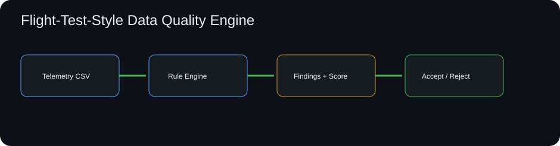

# Flight Test Data Quality Engine

[](https://github.com/skytruong90/Flight-Test-Data-Quality-Engine/actions/workflows/ci.yml)


A rule-driven data-quality engine for synthetic flight-test-style telemetry. It checks schema completeness, timestamps, sequence continuity, engineering ranges, rate-of-change limits, missing values, duplicate samples, and cross-signal consistency before analysis data is accepted.



> Public educational project. All signals, limits, and datasets are synthetic and are not real flight-test acceptance criteria.

## Why this project

Analytics can be mathematically correct and still produce misleading conclusions when the source data is incomplete, duplicated, out of order, or physically inconsistent. This project makes data-quality evidence a first-class artifact.

## Capabilities

- CSV telemetry ingestion
- configurable JSON quality rules
- required-column and null checks
- duplicate sequence detection
- timestamp monotonicity and maximum-gap checks
- numeric engineering-range checks
- maximum rate-of-change checks
- cross-signal rule: speed magnitude vs component velocities
- row-level findings with severity and rule ID
- weighted quality score and accept/reject gate
- cleaned/annotated CSV plus JSON and Markdown reports
- deterministic synthetic data generator with known defects
- tests and CI

## Run it

```bash
git clone https://github.com/skytruong90/Flight-Test-Data-Quality-Engine.git
cd Flight-Test-Data-Quality-Engine
python -m venv .venv
# Linux/macOS: source .venv/bin/activate
# Windows PowerShell: .venv\Scripts\Activate.ps1
python -m pip install -e ".[dev]"
flight-data-quality generate output/demo.csv --samples 300
flight-data-quality check output/demo.csv --rules examples/rules.json --report output/report.json --markdown output/report.md
pytest
```

## What I learned / demonstrated

- data-quality checks should run before downstream plots/statistics, not after suspicious results appear
- row-level rule IDs make findings actionable and auditable
- time/sequence integrity is just as important as value ranges for simulation and test data
- cross-signal consistency rules catch problems that single-column validation cannot
- an explicit quality gate prevents downstream pipelines from silently consuming unacceptable data

## Limitations

This is a software/data-engineering demonstration. Rules must be replaced and validated by the appropriate engineering authority before use on any real test program.
